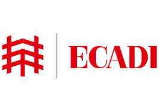

From <b>Nanjing, China</b>. Bachelor degree of Urban and Rural Planning in <b>NFJU</b> 

Urban Planner in <b>ECADI</b>  for 2 years

Currently pursuing a Master's degree of Science in Urban Spatial Science at <b>University College London!</b> 

Here is my <b> <a href="https://BohaoSuCC.github.io/" target="_blank"> Homepage</a></b>

<!--
**BohaoSuCC/BohaoSuCC** is a ✨ _special_ ✨ repository because its `README.md` (this file) appears on your GitHub profile.

Here are some ideas to get you started:

- 🔭 I’m currently working on ...
- 🌱 I’m currently learning ...
- 👯 I’m looking to collaborate on ...
- 🤔 I’m looking for help with ...
- 💬 Ask me about ...
- 📫 How to reach me: ...
- 😄 Pronouns: ...
- ⚡ Fun fact: ...
-->
